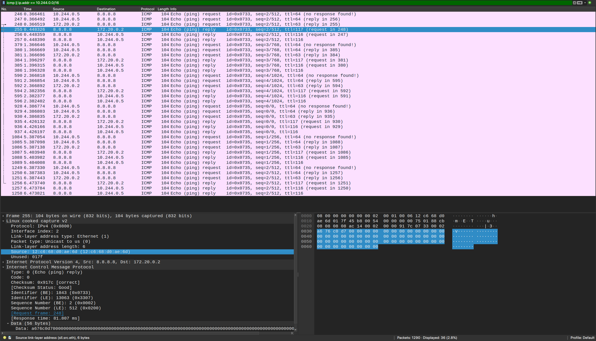
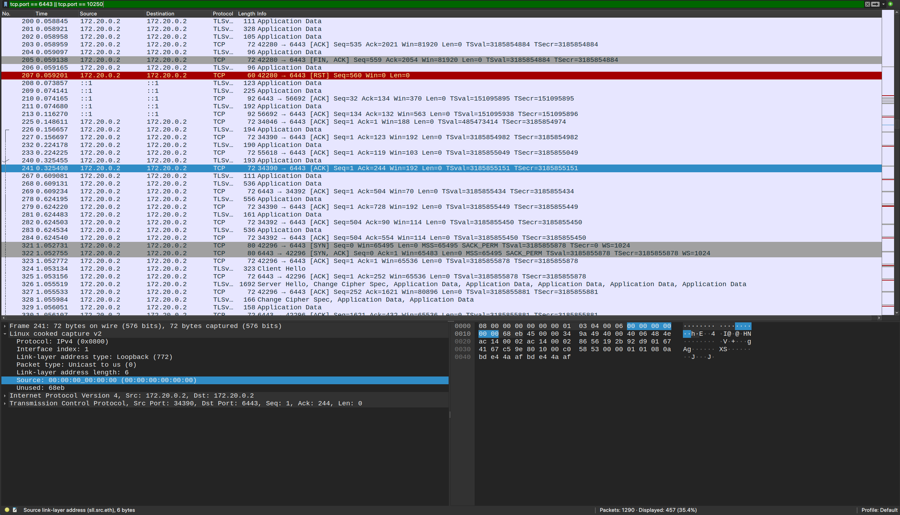

# Antrea Packet Capture Controller

A Kubernetes controller that performs on-demand packet captures for Pods using tcpdump.

## Overview

This controller runs as a DaemonSet on each node and watches for Pods with the `tcpdump.antrea.io` annotation. When detected, it starts packet capture using tcpdump and stops when the annotation is removed.

## Quick Start

```bash
# Annotate pod to start capture (keep max 5 files)
kubectl annotate pod test-pod tcpdump.antrea.io="5"

# Stop capture and cleanup
kubectl annotate pod test-pod tcpdump.antrea.io-
```

## How It Works

1. Controller watches Pods on its node using field selector
2. Detects `tcpdump.antrea.io: "N"` annotation
3. Runs `tcpdump -C 1 -W <N> -w /tmp/capture-<pod-name>.pcap -i any -n`
4. Automatically rotates files at 1MB, keeps max N files
5. Stops and cleans up when annotation is removed

## Setup

### 1. Create Kind Cluster with Antrea

```bash
# Create single-node cluster without default CNI
cat <<EOF | kind create cluster --name antrea-test --config=-
kind: Cluster
apiVersion: kind.x-k8s.io/v1alpha4
networking:
  disableDefaultCNI: true
  podSubnet: 10.244.0.0/16
nodes:
- role: control-plane
EOF

# Install Antrea (Option 1: Using Helm)
helm repo add antrea https://charts.antrea.io
helm repo update
helm install antrea antrea/antrea --namespace kube-system

# OR Install Antrea (Option 2: Using manifest)
kubectl apply -f https://github.com/antrea-io/antrea/releases/download/v2.2.0/antrea.yml

# Wait for Antrea to be ready
kubectl wait --for=condition=ready pod -l app=antrea -n kube-system --timeout=120s
```

### 2. Build and Deploy

```bash
# Build and load image
docker build -t packet-capture:latest .
kind load docker-image packet-capture:latest --name antrea-test

# Deploy controller
kubectl apply -f manifests/daemonset.yaml

# Deploy test pod
kubectl apply -f manifests/test-pod.yaml
```

### 3. Test

```bash
# Start capture
kubectl annotate pod test-pod tcpdump.antrea.io="5"

# Verify capture files
CAPTURE_POD=$(kubectl get pod -n kube-system -l app=packet-capture -o jsonpath='{.items[0].metadata.name}')
kubectl exec -n kube-system $CAPTURE_POD -- ls -lh /tmp/capture-test-pod.pcap*

# Copy and read pcap
kubectl cp kube-system/$CAPTURE_POD:/tmp/capture-test-pod.pcap0 capture.pcap
tcpdump -r capture.pcap -n | head -100

# Stop capture
kubectl annotate pod test-pod tcpdump.antrea.io-
```

### Screenshots

**ICMP Traffic from Test Pod:**

*Shows test pod (10.244.0.5) pinging 8.8.8.8 with successful replies*

**Kubernetes API Server Traffic:**

*Shows encrypted TLS traffic between nodes on port 6443*

## Architecture

- **Language**: Go 1.21
- **Base Image**: ubuntu:24.04
- **Deployment**: DaemonSet with hostNetwork
- **Permissions**: Privileged with NET_ADMIN/NET_RAW capabilities
- **Capture Location**: `/tmp/capture-<pod-name>.pcap*`

## Project Structure

```
.
├── main.go                 # Controller implementation
├── go.mod/go.sum          # Go dependencies
├── Dockerfile             # Multi-stage build
├── Makefile               # Build commands
├── manifests/
│   ├── daemonset.yaml    # DaemonSet + RBAC
│   └── test-pod.yaml     # Test Pod
└── outputs/               # Test validation outputs
    ├── pod-describe.txt
    ├── pods.txt
    ├── capture-files.txt
    ├── capture.pcap
    └── capture-output.txt
```

## Cleanup

```bash
kubectl delete -f manifests/test-pod.yaml
kubectl delete -f manifests/daemonset.yaml
kind delete cluster --name antrea-test
```

## License

[LICENSE](LICENSE)
